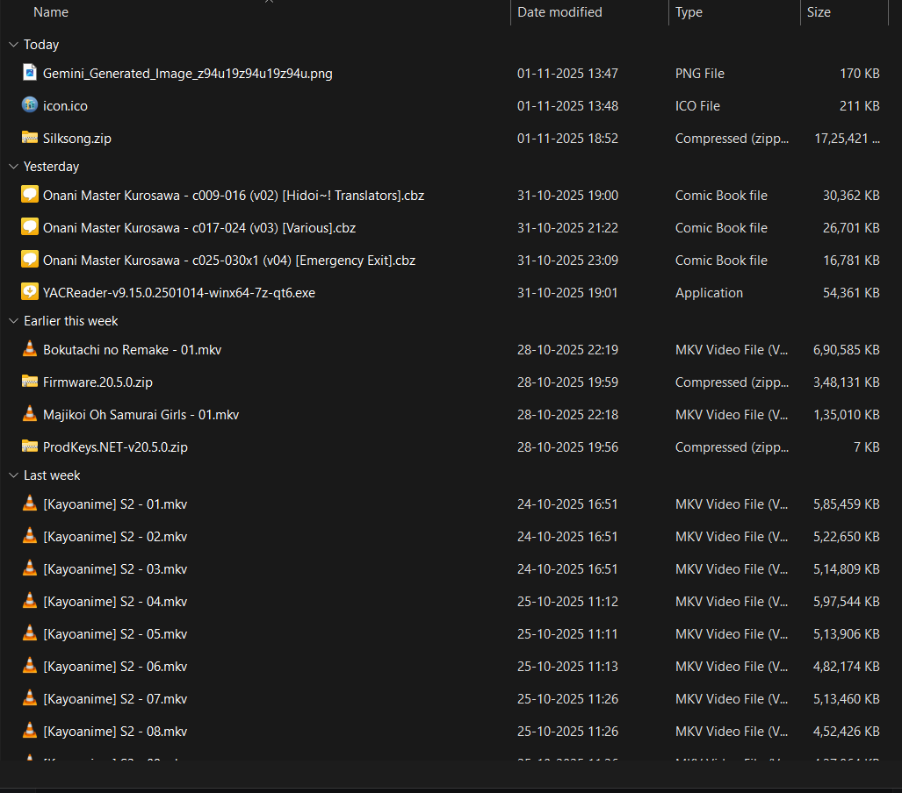
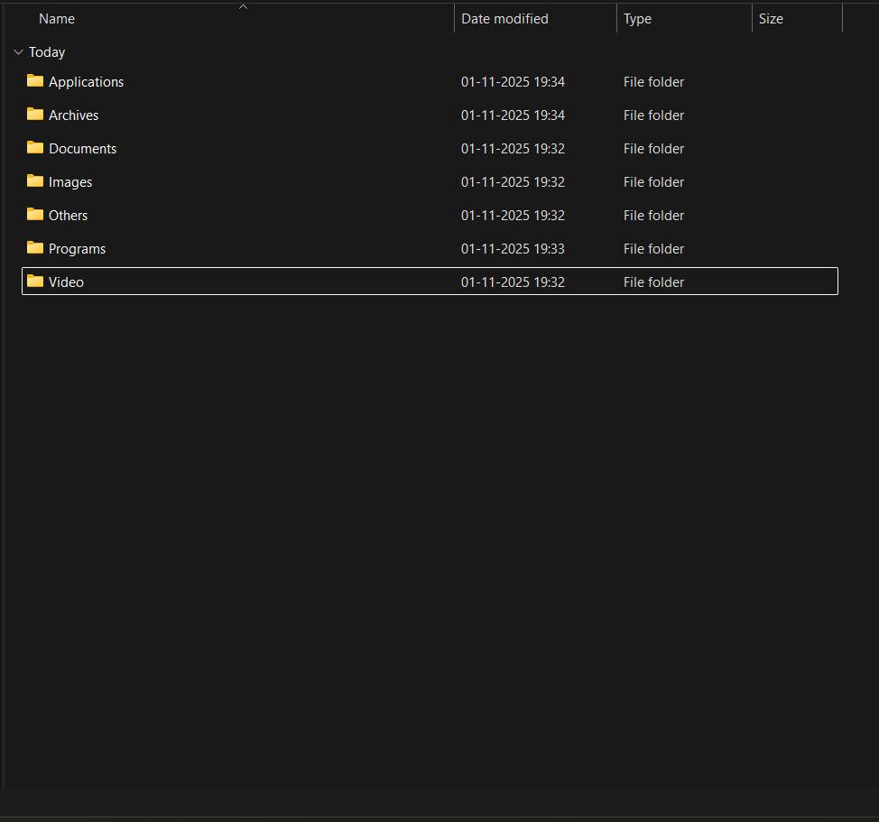

# 🗂️ Local File Organizer (Python + Tkinter)

A simple desktop app built with **Python** and **Tkinter** that helps you automatically organize files in any folder based on their type.  
It categorizes files like Images, Documents, Audio, Videos, Code files, Archives, etc., into separate subfolders.

---

## ✨ Features

- Select any folder using a GUI dialog
- Automatically sorts files into categorized subfolders
- Supports multiple file types (images, documents, media, code, etc.)
- Simple and clean interface built with Tkinter
- Works on Windows, macOS, and Linux

---

## 🖼️ Before and After

### 📁 Before Organization

### 🗃️ After Organization

---

## ❓ How to Use

1. **Download the latest release** (the `.exe` file) from the repository’s [Releases](../../releases) section.
2. Place the `.exe` file anywhere on your computer (e.g., Desktop).
3. Double-click to open the app.
4. Click **“Select Folder”**, choose the folder you want to organize.
5. Click **“Organize Files”** — the app will automatically create categorized subfolders.
6. You’ll see a **success message** once it’s done!

---

## 🧩 Tech Stack

- **Language:** Python
- **GUI:** Tkinter
- **Libraries:** `os`, `shutil`, `tkinter`, `filedialog`, `messagebox`
- **Packaged with:** PyInstaller (`pyinstaller --onefile file_organizer_gui.py`)

---

## 📄 License

This project is open-source under the [MIT License](LICENSE).

---

Made with ❤️ using Python
